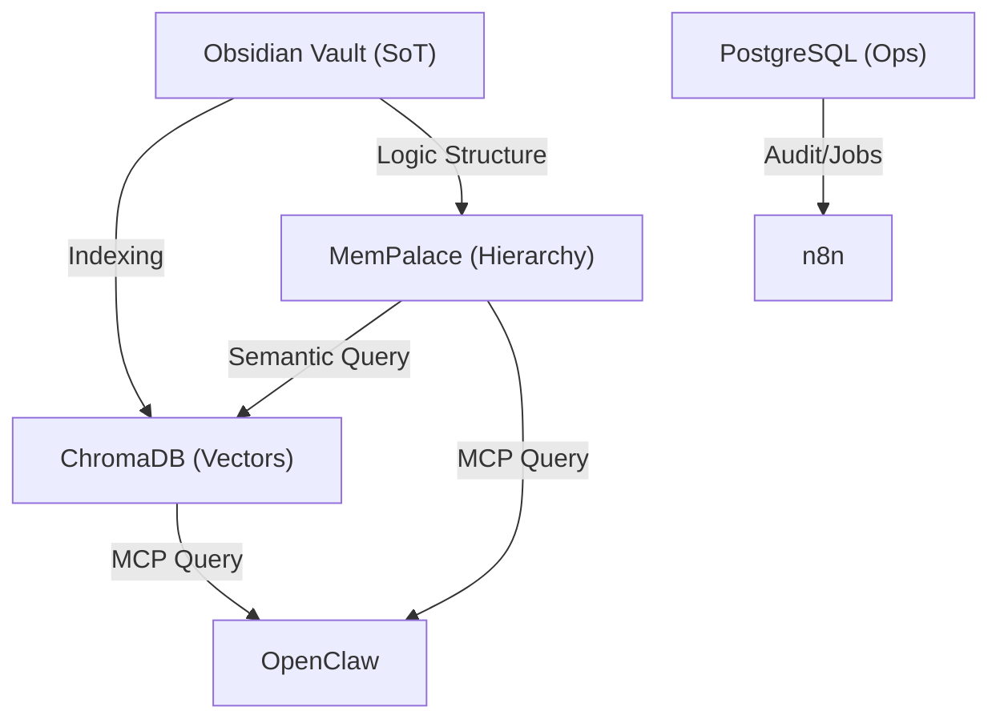

# Jarvis Memory Architecture

**Last Updated:** 2026-05-05  
**JARVIS Version:** 6.3 (Personal Operating Ecosystem)

The memory system of JARVIS is designed around the principle that **Obsidian is the Source of Truth (SoT)**. All other memory layers are derivative or auxiliary systems used for efficient retrieval.

## 🏗️ Memory Layers

| Generation | Layer | System | Purpose |
|---|---|---|---|
| **Gen 1** | **Semantic** | [[ChromaDB]] | Vector search for similarity-based retrieval. |
| **Gen 2** | **File Search** | [[QMD]] / [[M3_Memory]] | Direct filesystem exploration via tools/MCP. |
| **Gen 3** | **Compiled** | [[LLM_Wiki_Principles]] | Persistent markdown wiki with `index.md` routing. |
| **SoT** | **Canonical** | [[Obsidian]] | Markdown vault (Source of Truth) for humans and AI. |

---

## 🔄 Data Flow

---

## 📚 Key Components

### 1. [[Obsidian]]
The core vault where all ideas, logs, and documentation reside. It is the primary interface for the user to interact with the system's long-term memory.

### 2. [[ChromaDB]]
Provides the "semantic bridge." When an agent receives a query, it is converted into a vector and matched against the ChromaDB collection to retrieve relevant context from the vault.

### 3. [[MemPalace]]
An experimental layer that organizes information using a "Spatial Mnemonic" hierarchy, allowing agents to navigate knowledge like a physical building.

---

## Research Notes (Non-Canonical)

Recent ingest found two memory/workflow patterns worth tracking:

- [[Claude_OS]]: cross-KB search, session resume, KB lifecycle health/dedup/consolidation, and hybrid structural+semantic indexing.
- [[Agentic_OS]]: markdown-based operating layers for goals, backlog, tasks, knowledge, skills and evals.
- [[Repomix]]: temporary AI-friendly codebase snapshots for review and documentation; derived context, not memory SoT.
- [[NotebookLM_Py]]: optional source-grounded document research and artifact generation; useful for reports, but not canonical memory.
- [[LLM_Wiki_v2]]: confidence, supersession, retention, typed relationships and crystallization; adopt as wiki discipline now, automate later.
- [[Semble_Code_Search_MCP]] and [[GitNexus]]: code-specific retrieval/code graph candidates; useful later, not replacements for Obsidian SoT.

These should be treated as additive patterns. Obsidian remains the human source-of-truth; ChromaDB/MemPalace remain derivative retrieval layers unless the official architecture is explicitly revised.

---

## v6.3 User Knowledge Extension

The GiustoDev/Muffin ingest adds a critical distinction: JARVIS memory must not only remember documents and tasks, but also model the user through evidence-based knowledge.

New memory concepts to track:

- **biographical memory**: life context such as student, worker, commuter, living situation.
- **relationship memory**: family, friends, partner, colleagues and relationship type.
- **routine memory**: gym, meals, sleep, study, creative sessions, commute.
- **ambient context memory**: authorized home/device signals such as lights, presence, room state and music scenes.
- **pattern memory**: repeated behaviors such as procrastination, skipped meals or post-workout fatigue.
- **observation memory**: matured insight, not a raw inference.

Important rule:

> Examples are not hardcoded features. Gym, university, meals, lights or partner status are instances of an open user knowledge ontology.

JARVIS must distinguish:

- fact;
- state;
- routine;
- pattern;
- preference;
- relationship;
- exception;
- hypothesis;
- boundary.

See [[Jarvis_User_Knowledge_Ontology]] and [[Jarvis_Final_Feature_Vision]].

---

## Related Components
- [[Jarvis_Agentic_Architecture]]
- [[Jarvis_User_Knowledge_Ontology]]
- [[Jarvis_Final_Feature_Vision]]
- [[GiustoDev_Muffin_Architecture]]
- [[M3_Memory]]
- [[LLM_Wiki_v2]]
- [[Semble_Code_Search_MCP]]
- [[GitNexus]]
- [[QMD]]
- [[Workflow]]

**Sources:** `raw/Jarvis_Documentation/Documentazione Memoria/README.md`, [[PROGETTO_JARVIS_MASTER.md]]
